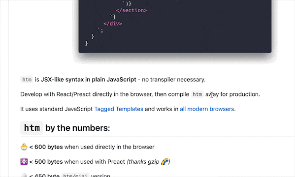
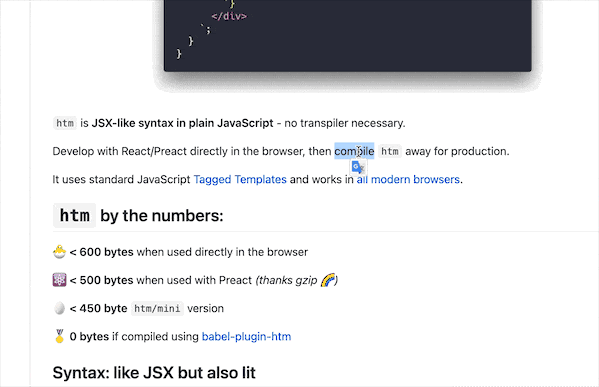
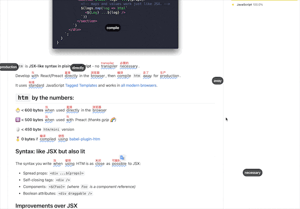
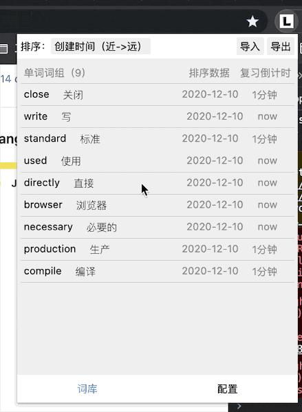
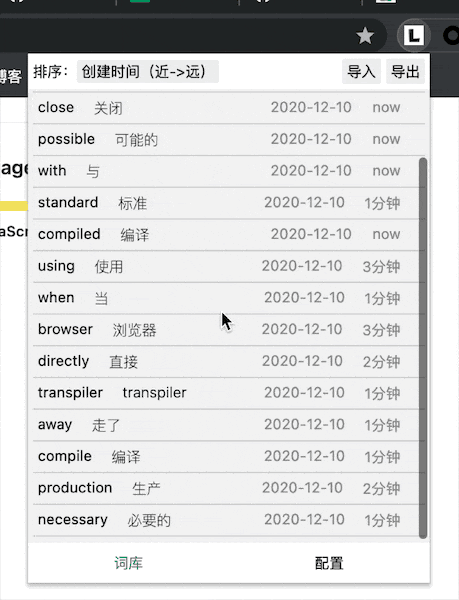
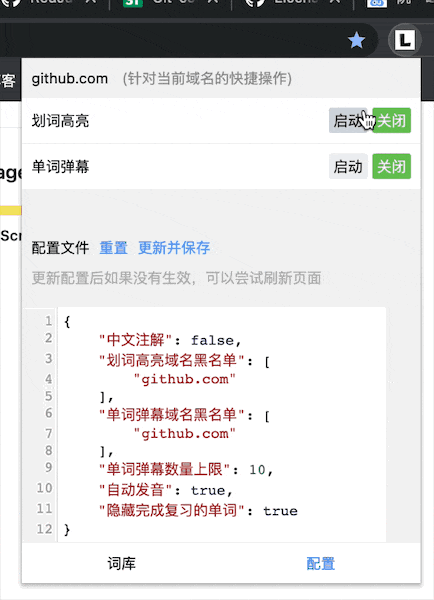

# BlueSea

BlueSea，是一个有趣的英语学习扩展程序。她支持划词翻译、单词高亮、单词弹幕、记忆曲线复习、词频统计...


## 内容列表

- [背景](#背景)
- [开发与使用](#开发与使用)
- [配置项](#配置项)
  - [有道智云配置](#有道智云配置)
- [演示](#演示)
- [补充](#补充)
- [更新日志](#更新日志)
- [维护者](#维护者)
- [如何贡献](#如何贡献)


## 背景

作为开发者，虽然日常总是与英语打交道，但通常是带有强烈目的性的。

因此，在解决技术问题或学习新技能的过程里，遭遇模陌生的单词时，往往直接借助翻译软件，一掠而过。不做记忆，同一个生词下次再相遇依旧不认识。

BlueSea，就是用来解决这个问题的 🔧 。她会帮你记下在日常工作、生活中遭遇的生词，并设计一套科学的复习方案，有趣的复习方式来帮助你记住更多的单词。当然，不仅仅是背单词，她能做更多。

***现有功能清单：***

* 页面英文划词翻译、发音
* 本地单词管理（单词本）
* 词频统计（总词频，当日词频，页面内词频）
* 精确的全局单词高亮
* 单词弹幕（复习、发音）
* 卡片式单词复习功能（仅在单词弹幕关闭时生效）
* 根据遗忘曲线，自动安排单词学习计划（卡片或弹幕）
* 导入/导出
* 单词查询


## 开发与使用

***下载代码到本地***

```bash
git clone https://github.com/jiangqizheng/BlueSea
```

在 chrome 地址栏输入 `chrome://extensions/` 进入到扩展程序管理界面，然后点击 `加载已解压的扩展程序` 选择刚刚下载到本地的 BlueSea 目录即可。

> 当前为测试阶段，请加载已解压的扩展程序来使用。安装扩展后，建议刷新页面。

***更新***

直接使用 `git pull` 进行更新，更新后重启 chrome 或刷新页面即可。

<details>

<summary><b>如出现文件合并冲突提示: `error: Your local changes to the following files would be overwritten by merge`</b></summary>

可以使用

```bash
`git add -A`
`git commit -m "update"`
`git pull`
```
</details>

## 配置项

```js
{
	"划词翻译": true, //基础配置（优先级最高），是否启动划词翻译
  	"单词高亮": true, //基础配置
	"单词弹幕": true, //基础配置
	"黑名单": [],
	"中文注解": true,//全局高亮的时候，是否在单词右上角直接显示中文翻译
	"划词默认发音": true,//划词或者鼠标移入弹幕时，是否自动发音
	"单词弹幕数量上限": 10,//一屏内单词弹幕数量，据电脑性能量力而行
	"单词弹幕速度": 10, // 单位秒，默认为弹幕走完一个周期需要10秒
	"隐藏完成复习的单词": true//出于性能考虑，建议保持隐藏
 	"有道智云appkey": "", //参考下面说明，配置后支持句子翻译
  	"有道智云key": "", //参考下面说明，配置后支持句子翻译
}
```
> 后续会逐步增加可配置项（自定义遗忘曲线、高亮样式、弹幕速度...）

### 有道智云配置

因我的【有道智云】免费额度即将耗尽，所以暂时限制句子翻译，目前仅支持单词与短语翻译（小于四个单词）如需句子翻译，更新插件至最新、并在配置内添加自己的 `有道智云key` 与 `有道智云appkey`。


申请有道智云翻译服务流程：

* 注册[有道智云](http://ai.youdao.com/)帐号并登录到控制台页面
* 创建一个翻译实例：控制台 > 自然语言翻译 > 翻译实例 > 创建翻译实例
* 创建一个应用并绑定翻译服务：控制台 > 应用管理 > 我的应用 > 创建应用 > 绑定服务
* 最后在应用详情中，可以看到应用ID（`有道智云appkey`）与应用密钥（`有道智云key`），然后将其添加至插件的配置中，保存并更新，然后刷新页面即可。

其他：

* 如果不需要句子翻译，就无需进行配置。默认已经支持了单词与短语翻译，通常来说够用了。
* 关于价格，注册后，系统赠送50元代金券，可以额外添加微信领取50元，累计100元额度。按其每百万字符48元的价格，够用上一年了。
* 关于安全性，配置key后，后台不会做任何记录。如果对安全性存疑， 在 `background.js` 中自行调用有道智云api即可。或者自行部署腾讯云函数也一样。

## 演示

> 仅供参考，迭代后实际界面可能已经发生改变。

### 在页面上遇到生词，进行**划词翻译、发音**



### 将生词加入单词本，并根据遗忘曲线，生成复习计划。在复习期间内的单词，将在页面内被**高亮展示**，鼠标移入可以查看信息。



### 单词到复习时间，自动创建**单词弹幕**在页面内出现，选择认识或不认识，动态调整复习计划。



### 单词卡片，查看单词具体信息



### 单词本，进行单词管理，或查看词频与其他信息



### 配置中心，进行各类配置设定




## 补充
* 部分页面可能因网站设置了 csp 安全策略，会导致发音失败。
* 关于根据遗忘曲线生成的复习时间节点逻辑说明，单词具有一个 level 字段，每次进行操作后会进行 +1 或 归零，然后根据最新的 level 生成下一次需要复习的时间节点。
* 关于默认设置的遗忘曲线为[5,30,12 * 60,24 * 60,2 * 24 * 60,4 * 24 * 60,7 * 24 * 60,15 * 24 * 60,30 * 24 * 60] （单位分钟）。单词被收藏5分钟后将提示复习，然后是30分钟后，12小时后，以此类推。
* 导出，支持 .json 与 .txt 导出。如果需要更多的导出格式，提交 pr 或者在 issues 中指出。
* 导入，支持 .json 与 .txt 导入，具体格式参考导出的数据（使用 .txt 进行导入时，因为需要拉取每个单词的翻译信息所以会比较慢，并在导入期间内，不要进行其他操作）。
* 关于性能，已测试在一个页面内最多标记 100+ 单词。单词本中测试收录 5000+ 单词，后续增加分组功能，缓解性能压力。
* 翻译提示窗部分样式参考 [ChaZD](https://chrome.google.com/webstore/detail/chazd/nkiipedegbhbjmajlhpegcpcaacbfggp)


## 更新日志

[CHANGELOG.md](./CHANGELOG.md)

## 维护者

[@jiangqizheng](https://github.com/jiangqizheng)。

## 如何贡献

非常欢迎你的加入！[提一个 Issue](https://github.com/jiangqizheng/BlueSea/issues/new) 或者提交一个 Pull Request。

欢迎Star、Fork、

### 贡献者

后续更新

